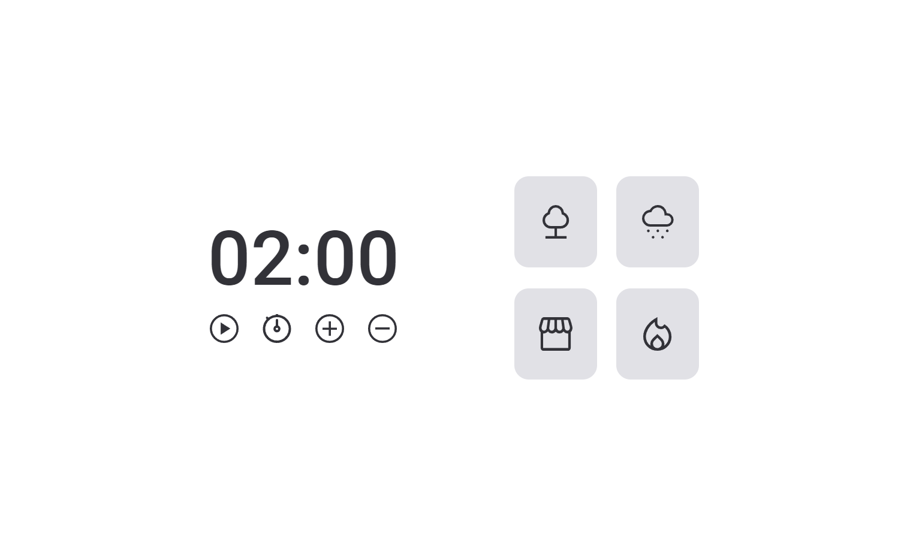

<h1 align="center"> Focus Timer </h1>

  <a href="#-tecnologias">Technologies</a>&nbsp;&nbsp;&nbsp;|&nbsp;&nbsp;&nbsp;
  <a href="#-projeto">Project</a>

 

  

## 💻 Project

The Focus Timer is a project of Explorer course from Rocketseat, an application that run a timer to daily task.

## 🚀 Technologies

This project has been developed with the following technologies:

- HTML
- CSS
- JavaScript
- ES6(module)
